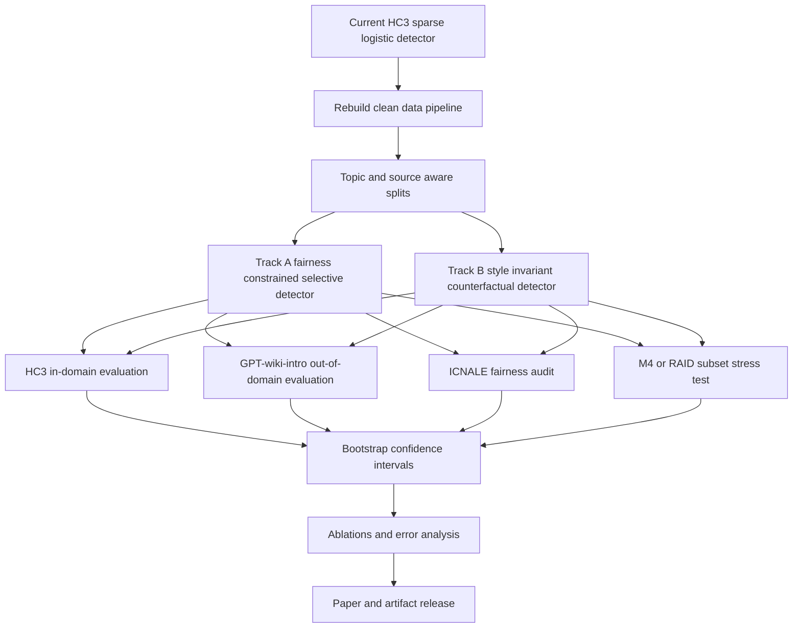
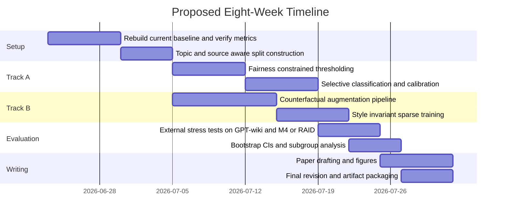

# Deep Research Report on HC3 Logistic Regression AI-Text Detection Extensions

## Executive Summary

Your uploaded project report actually specifies the core setup that the prompt described as “unspecified.” The current system is an interpretable AI-text detector trained primarily on **HC3** with **logistic regression** over **word TF-IDF**, **character TF-IDF**, and **lexical/readability statistics**, and evaluated on **HC3**, **GPT-wiki-intro**, and **ICNALE**. In your saved run, the model is very strong in-domain on HC3, but it fails badly under domain and population shift: your report shows high false-positive rates on GPT-wiki-intro and ICNALE, while a conservative education threshold sharply reduces false positives at the cost of large recall loss. That means the publishable problem is already clear: **how to keep the interpretability and low-cost deployment of a sparse logistic detector while improving robustness and fairness under shift**. fileciteturn0file0

Across the search, I found **one clear external exact-match paper** that uses **HC3 plus a TF-IDF logistic-regression baseline**: Alikhanov et al. 2026. I did **not** find a deep pool of peer-reviewed papers that match both your exact dataset and exact model family. The stronger peer-reviewed literature instead clusters around three adjacent lines: **the HC3 source paper and released detectors**, **fairness papers on non-native English writing**, and **robustness/generalization papers showing that detector performance collapses across domains, generators, or edits**. The best high-value papers for your project are therefore a mix of **exact-match**, **same-dataset**, and **highly relevant adjacent** work. citeturn1academia1turn2view0turn40academia0turn18view0turn44view0

The strongest publishable opportunity is **not** to replace your model with a transformer. It is to turn your current pipeline into a **fairness-constrained, selective, style-invariant sparse detector**. Concretely, the two most promising modifications are: **a subgroup-calibrated abstaining detector with formal coverage/risk reporting**, and **a counterfactually augmented, style-invariant sparse logistic model trained to reduce reliance on artifact-heavy character/style cues**. Both are feasible with the codebase and data you already have, both are much cheaper than end-to-end transformer research, and both directly address the failure modes surfaced in your current report. fileciteturn0file0turn40academia0turn44view0turn14academia1

## Match Landscape and Comparison Table

The present project aligns most directly with the literature in this order: **exact HC3 + TF-IDF logistic regression**, then **HC3 detector papers**, then **fairness papers for learner/non-native English**, then **robustness/generalization benchmarks**. Your current report already demonstrates the key empirical gap that this literature would predict: excellent HC3 test performance does not imply safe deployment on GPT-wiki-intro or ICNALE. fileciteturn0file0turn44view0turn14academia1turn40academia0

| Paper | Match level to your project | Venue or source | What matters most for you | Best extension it suggests |
|---|---|---|---|---|
| **Guo et al. 2023** citeturn2view0turn34view0turn39view0 | Same dataset; adjacent model | HC3 original paper and official repo/model cards | HC3 is the canonical benchmark lineage for your work; released detectors include RoBERTa and linguistic-feature variants | Rebuild your evaluation around HC3-aware splits, released detectors, and stronger held-out calibration |
| **Alikhanov et al. 2026** citeturn1academia1 | **Exact external match** on dataset/model family | arXiv preprint | HC3 + TF-IDF logistic regression remains a credible low-cost baseline; topic-based splitting matters | Reproduce topic-holdout LR, then add fairness and abstention layers |
| **Liang et al. 2023** citeturn40academia0 | Adjacent fairness paper | *Patterns* | Detectors can systematically over-flag non-native English writing | Add subgroup-constrained thresholding, CEFR-aware reporting, and counterfactual style controls |
| **Ghostbuster 2024** citeturn18view0turn35view0 | Adjacent feature-based model | NAACL 2024 | Feature-based detection can generalize better than naive detector baselines without target-model access | Add lightweight LM-derived signals to your sparse model, or use disagreement as abstention trigger |
| **M4 2024** citeturn44view0turn36view0 | Adjacent robustness benchmark | EACL 2024 | Cross-domain, cross-generator, multilingual, and time-domain shift are central, not edge cases | Add leave-one-domain/generator-out tests and time-shift evaluation beyond HC3 |
| **Weber-Wulff et al. 2023** citeturn14academia1 | Adjacent educational deployment study | *International Journal for Educational Integrity* | Real academic-use detectors are unreliable and obfuscation worsens behavior | Frame your paper around deployment safety, not just raw detection accuracy |

The most important conclusion from this table is strategic: if you want a paper that is both publishable and realistically implementable, you should **stay with the sparse interpretable detector as the core method**, but add **formal safety mechanisms and stronger shift-aware evaluation** rather than trying to chase leaderboard-level black-box accuracy. fileciteturn0file0turn14academia1turn44view0turn18view0

## Analytical Summaries of Selected Papers

### Guo and colleagues on HC3

Guo et al. introduced **HC3**, the Human ChatGPT Comparison Corpus, with an English portion containing **24,322 questions, 58,546 human answers, and 26,903 ChatGPT answers**, plus a Chinese portion with seven splits. The official repository states that the project released **three detector types**: a **QA detector**, a **single-text detector**, and a **linguistic-feature detector**. The official Hugging Face model card for the released English single-text detector says it is built on **`roberta-base`** and trained on HC3 for **one epoch** using a mix of full-text and split-sentence representations. This makes Guo et al. the foundational paper for your study even though the released flagship detector is transformer-based rather than logistic regression. citeturn2view0turn34view0turn39view0

The strengths of this paper are obvious: it created the benchmark lineage your project is already using, released code and model artifacts, and made later HC3-based work possible. The limitations are equally important for your paper framing. HC3 is early-ChatGPT-era data, the released detector ecosystem is centered on held-out benchmark performance, and the later robustness literature shows that detectors trained in this style do not automatically generalize across domains, time periods, or writer populations. In other words, Guo et al. gives you the **right starting point**, but not the **safe deployment answer**. citeturn2view0turn34view0turn39view0turn44view0turn40academia0

| Concrete extension | Novelty and expected impact | Required resources | Main risks | Evaluation plan |
|---|---|---|---|---|
| **HC3 topic-aware re-splitting** | Publishable because it addresses leakage and overfitting to prompt/source artifacts; expected to lower overly optimistic HC3 scores | Low | Lower raw numbers may look worse | Compare current group split vs topic/source-holdout split; report AUROC, F1, TPR@FPR≤1% |
| **Sparse-group feature-family regularization** | Preserves interpretability while preventing character n-grams from dominating; expected to improve fairness stability | Low to moderate | May reduce HC3 peak accuracy | Compare vanilla LR vs elastic-net vs sparse-group LR with word/char/stats family penalties |
| **Official-detector agreement analysis** | Strong paper add-on because it compares your detector to the released HC3 RoBERTa model under the same data conditions | Low | Baseline may outperform on HC3 but not under shift | Run paired evaluation on HC3 and shifted sets; analyze agreement, disagreement, and false-positive overlap |

### Alikhanov and colleagues on HC3 with TF-IDF logistic regression

Alikhanov et al. is the clearest external match to your setup. The paper evaluates AI-text detectors using **HC3** and **DAIGT v2**, explicitly applies a **topic-based split** to reduce leakage, and reports that **TF-IDF logistic regression** reaches **82.87% accuracy**, while **BiLSTM** reaches **88.86%** and **DistilBERT** reaches **88.11%** with the best **ROC-AUC of 0.96**. That makes it very useful strategically even though it is currently an **arXiv preprint**, not a peer-reviewed venue paper. citeturn1academia1

For your project, this paper matters for two reasons. First, it confirms that **classical sparse models remain credible baselines** in modern AI-text detection. Second, it shows that **split design matters**: topic-based partitioning is a real lever for avoiding inflated performance. Its main weakness, from your perspective, is that the accessible abstract does not expose the full fairness protocol or the kind of learner-English audit that your current report already performs. That creates a direct opening for you: take the same baseline family and make it **fairness-aware and deployment-aware** rather than accuracy-only. citeturn1academia1turn40academia0turn14academia1

| Concrete extension | Novelty and expected impact | Required resources | Main risks | Evaluation plan |
|---|---|---|---|---|
| **Reproduce topic-based HC3 split, then add ICNALE audit** | Strong because it converts a generic benchmark paper into an educational fairness study | Low | In-domain performance will likely drop | Train on topic-holdout HC3; evaluate on GPT-wiki-intro and ICNALE |
| **Hybrid sparse LR with lexical-stat families retained separately** | Closer to your current system than plain TF-IDF; expected to clarify where robustness comes from | Low | Incremental novelty if not paired with fairness results | Ablate word-only, char-only, stats-only, and combined models |
| **Bootstrap confidence intervals and decision-threshold auditing** | Highly publishable in an educational setting because it strengthens the reliability argument | Low | Adds analysis work, not headline accuracy gains | Report 95% CIs for HC3, GPT-wiki-intro, and subgroup FPRs |
| **Train-time prevalence and shift sensitivity study** | Helps explain when LR works and when it fails | Low | Could become descriptive unless tied to intervention | Vary class balance, text length, and source mixes; inspect threshold transfer |

### Liang and colleagues on bias against non-native English writers

Liang et al., published in *Patterns*, evaluates widely used GPT detectors on writing from native and non-native English speakers and finds that detectors **consistently misclassify non-native English writing as AI-generated**, while native writing is more often correctly identified. The paper also finds that **simple prompting strategies** can both mitigate the observed bias and help evade detectors, and it explicitly warns against high-stakes reliance on these systems in evaluative settings. This is one of the most important papers for your project because your own ICNALE audit is aimed at essentially the same failure mode. citeturn40academia0

The limitation for direct replication is that Liang et al. studies several off-the-shelf detectors rather than your exact sparse logistic model. But that is actually useful for publication: it means you can position your paper as the question Liang et al. leaves open for interpretable classical detectors—**can a transparent sparse detector be made measurably safer for learner-English writers without collapsing utility?** Your current report suggests the answer is “not yet,” which is precisely what makes the extension publishable. citeturn40academia0turn14academia1turn0file0

| Concrete extension | Novelty and expected impact | Required resources | Main risks | Evaluation plan |
|---|---|---|---|---|
| **Subgroup-constrained threshold optimization** | Directly aligned with fairness literature; likely to reduce learner/native FPR gap | Low | Recall may drop if constraint is too strong | Optimize threshold on held-out human data with explicit learner/native FPR constraints |
| **CEFR-aware calibration and reporting** | More nuanced than native vs learner; likely publishable in education venues | Moderate | Requires careful ICNALE metadata handling | Report FPR by CEFR, native status, length bin, and prompt/module |
| **Counterfactual style-control audit** | Strong novelty: test whether simplification, punctuation normalization, or grammar correction changes detector scores | Moderate | Synthetic edits may introduce label uncertainty | Apply controlled rewrites to human essays and measure score shifts |
| **Fairness-penalized logistic regression** | Method novelty without abandoning interpretability | Moderate | Optimization may be unstable on sparse high-dimensional features | Add penalty on subgroup FPR gap or worst-group loss; compare with post-hoc thresholding |

### Ghostbuster on feature-based robust detection

Ghostbuster is a NAACL 2024 paper that stays much closer to your modeling philosophy than most transformer-heavy detector papers. It **passes text through weaker language models**, performs a **structured search over feature combinations**, and trains a classifier on the resulting signals. It does **not require access to token probabilities from the target generator**, and the paper reports **99.0 F1 across domains**, outperforming prior methods in cross-domain, cross-prompt, and cross-generator generalization. The official repository also releases datasets in **student essays, creative writing, and news**, and warns that the detector is especially risky on **short text**, **unseen domains**, **non-American/British English**, **non-native English**, and **human-edited AI text**. citeturn18view0turn35view0

This paper’s main value for you is methodological. It shows that **feature-based systems can still be competitive** if the features are not just naive TF-IDF artifacts. At the same time, the repository disclaimer supports your current paper’s cautionary message: even stronger detectors have serious deployment limitations. The weakness for your purposes is dependency on weaker-LM signals and a more complex search procedure than plain logistic regression. That is still workable as an extension because you can borrow the **ideas** without fully re-implementing the original system. citeturn18view0turn35view0

| Concrete extension | Novelty and expected impact | Required resources | Main risks | Evaluation plan |
|---|---|---|---|---|
| **LM-signal augmentation for sparse LR** | Add a few Ghostbuster-like LM statistics to your existing sparse features; expected to improve robustness modestly | Moderate | Extra inference cost, possible overfitting to LM artifacts | Compare base LR vs LR + weak-LM features on HC3, GPT-wiki-intro, ICNALE |
| **Disagreement-triggered review zone** | Practical and publishable: if sparse LR and a Ghostbuster-style module disagree, abstain | Moderate | Coverage may become too low | Measure selective risk, coverage, and false-positive reduction |
| **Symbolic-search feature distillation** | Good novelty: distill richer features into a final interpretable linear model | Moderate | Engineering complexity | Fit linear model on discovered features; inspect coefficient stability and family contributions |
| **Open-model replacement for proprietary signals** | Makes the design reproducible and more acceptable academically | Moderate | Open models may underperform vs original | Use small open LMs for perplexity/logprob-like features; compare cost-performance trade-offs |

### M4 on robustness across domains, generators, languages, and time

M4 is a peer-reviewed **EACL 2024** paper and **Best Resource Paper Award** winner. The official repository says the benchmark studies **RoBERTa**, **ELECTRA**, and **XLM-R** detectors, plus **logistic regression with GLTR features** and an **SVM with NELA stylistic features**. It evaluates detectors in **same-generator cross-domain**, **same-domain cross-generator**, **multilingual**, and **time-domain** settings; the repository explicitly notes a **time-domain evaluation** that compares **Reddit-ELI5 text from HC3** with newer M4 data, highlighting that the timing of ChatGPT generations matters. The official paper page and repo both emphasize the same central result: detectors struggle to generalize to **unseen domains or LLMs** and tend to misclassify machine-generated text as human-written under those shifts. citeturn44view0turn36view0

For your project, M4 is crucial because it provides the external validation template you currently need. Your report already shows harmful false positives under shift; M4 shows that such behavior is part of a broader detector-generalization problem, not a one-off accident. The limitation is that M4 is broader than your educational deployment focus, so you should use it as **external stress testing** rather than as the sole paper framing. citeturn44view0turn36view0turn0file0

| Concrete extension | Novelty and expected impact | Required resources | Main risks | Evaluation plan |
|---|---|---|---|---|
| **Leave-one-domain-out HC3 training** | Clean robustness study that matches M4’s philosophy | Low to moderate | May depress HC3 averages substantially | Train on all-but-one HC3 source split; test on held-out source and external sets |
| **Leave-one-generator-out external validation** | Stronger paper if you add M4 or RAID subsets | Moderate | Data wrangling overhead | Evaluate on unseen generators without retraining decision threshold |
| **Time-shift evaluation** | Very publishable because it directly tests detector aging | Moderate | Requires newer generation sets | Compare old HC3-era detector vs newer generated text; report threshold drift |
| **Calibration transfer study** | Fits your current failure mode exactly | Low | Could be seen as descriptive unless tied to intervention | Learn threshold on HC3 only, then on pooled human calibration sets, then on subgroup-aware splits |

## Recommended Publishable Extensions

The shortlist below ranks candidate modifications by **publishability**, **technical feasibility**, and **alignment with the weakness already shown by your report**. The first two are the ones I would actually pursue. The supporting papers behind this ranking are your project report plus Guo, Liang, Ghostbuster, M4, and the educational-integrity literature. fileciteturn0file0turn2view0turn40academia0turn18view0turn44view0turn14academia1

| Proposed modification | Novelty | Feasibility | Expected impact | My recommendation |
|---|---|---:|---:|---|
| **Fairness-constrained selective logistic detector** | Moderate | High | High on deployment safety | **Pursue** |
| **Counterfactual style-invariant sparse detector** | High | Moderate | High on fairness and OOD robustness | **Pursue** |
| Weak-LM feature augmentation in sparse LR | Moderate | Moderate | Moderate | Good fallback |
| Topic-holdout and leave-one-domain-out HC3 study only | Low to moderate | High | Moderate | Necessary as an ablation, not enough alone |
| Full transformer replacement | Low for your paper | Moderate to high | Uncertain | Not recommended as the main contribution |

The **best first paper** is a **fairness-constrained selective detector**. Keep the sparse logistic-regression core, but move from a single hard threshold to a **three-way decision policy**: *human*, *review zone*, and *high-confidence AI*. Calibrate the review policy on held-out human writing that includes learner-English data, and optimize thresholds subject to explicit subgroup false-positive constraints. This directly extends the “conservative education threshold” already in your report into a more formal selective-classification study, which is much more publishable than just “raise the threshold.” fileciteturn0file0turn40academia0turn14academia1

The **best second paper** is a **counterfactually augmented style-invariant sparse detector**. Your report already shows that feature combinations that maximize HC3 F1 can amplify ICNALE false positives. The natural next step is to generate or construct **style-preserving counterfactuals** for both human and AI text—simplification, formalization, punctuation normalization, grammar correction, paraphrase, length matching—and train the detector so that the label should remain stable under those transformations. That gives you a much stronger claim than “we audited fairness”: you can claim to have **actively reduced reliance on style artifacts** while keeping the model interpretable. fileciteturn0file0turn40academia0turn44view0turn41academia1

## Experimental Plan

### Core design

The experimental workflow should treat your current saved model as the **reference baseline**, not as something to discard. Then create two intervention tracks.

This should be run with the current project’s data logic as the starting point: HC3 as training source, GPT-wiki-intro as out-of-domain benchmark, and ICNALE as the human-only fairness audit. Your report already shows why all three are necessary. fileciteturn0file0turn47view0turn47view1

### Data splits and baselines

Use four split families.

First, keep your current **group-aware HC3 train/validation/test** split so the new work stays comparable to the existing report. Second, add a **topic/source-holdout HC3 split** inspired by the exact-match logistic baseline paper. Third, add **leave-one-HC3-domain-out** experiments using the five English source families visible in HC3. Fourth, if time permits, add a **small external M4 or RAID subset** for unseen-generator stress testing. fileciteturn0file0turn1academia1turn2view0turn36view0turn37view0

The baseline set should be:

- **Current sparse LR default threshold** and **education threshold** from your report. fileciteturn0file0
- **Word-only**, **char-only**, **stats-only**, and **combined** sparse models. Your report already hints that these ablations matter. fileciteturn0file0
- **Hello-SimpleAI HC3 RoBERTa** as the official same-dataset detector baseline. citeturn39view0turn34view0
- **DetectGPT** and **Binoculars** on a sampled subset, because they are standard zero-shot baselines, but they are not the main systems of record for your paper. citeturn46academia0turn46academia2
- If feasible, a **Ghostbuster-style feature-augmented baseline** or the released Ghostbuster implementation on a manageable subset. citeturn18view0turn35view0

### Metrics and reporting

On binary datasets, report **AUROC**, **AUPR**, **macro-F1**, **FPR**, **TPR**, **TPR at FPR≤1%**, and **balanced accuracy**. For the abstaining detector, add **coverage**, **selective risk**, and **review-zone rate**. For calibration, add **Brier score**, **ECE**, and threshold-transfer plots. For fairness, report **learner FPR**, **native FPR**, **FPR gap**, and, if metadata supports it, **CEFR-stratified FPR**. Use **bootstrap 95% confidence intervals** everywhere, because your current report explicitly notes that these were supported but not enabled. fileciteturn0file0turn40academia0turn14academia1

### Track A fairness-constrained selective detector

Start with your existing feature set and logistic-regression backbone. Add:

- **Elastic-net or sparse-group regularization** so that word, character, and statistics families can be controlled separately.
- **Subgroup-aware validation** using pooled HC3-human and ICNALE-human calibration data.
- **Dual-threshold or tri-threshold selective policy**: low-score human, mid-score review, high-score AI.
- Optional **fairness penalty or reweighting** minimizing worst-group validation loss.

The main ablations should compare: no fairness constraint, post-hoc threshold-only fairness constraint, and train-time fairness penalty; no abstention vs abstention; HC3-only calibration vs pooled-human calibration; and with vs without character n-grams. The hypothesis is that the review-zone formulation will reduce harmful false positives far more gracefully than a single extreme threshold. fileciteturn0file0turn40academia0turn14academia1

### Track B style-invariant counterfactual detector

Construct paired or grouped counterfactuals:

- **Human text**: grammar-corrected, punctuation-normalized, simplified, formalized, spell-corrected, length-normalized.
- **AI text**: paraphrased, shortened, expanded, synonym-shifted, punctuation-perturbed.
- **Matched pairs**: where possible, create counterfactuals that alter surface style but should preserve the human/AI label.

Then train the sparse model on original plus augmented data, optionally with a **consistency objective** at the score level. The goal is not to maximize raw HC3 performance. The goal is to reduce score volatility under style edits and reduce the learner/native false-positive gap. This track is strongly supported by Liang’s bias framing and by robustness work showing that paraphrasing and attacks can break detectors. citeturn40academia0turn41academia1turn44view0

### Compute, staffing, and timeline

This project remains lightweight if you keep the sparse detector at the center. My estimate is:

- **Sparse-model training and ablations**: CPU-friendly; one workstation with **32–64 GB RAM** is usually enough for large sparse matrices, with optional GPU only for transformer baselines.
- **Counterfactual data generation**: the main cost driver if you use open LMs or API calls.
- **Zero-shot baseline evaluation**: run on sampled subsets to keep cost bounded.
- **Statistical analysis and plotting**: trivial compared with model training.

A realistic timeline is below.

## Target Venues and Source Links

The venue recommendation depends on which of the two top modifications you pursue most aggressively.

If the main contribution is **harm-reduction, selective abstention, subgroup calibration, and careful educational-use guidance**, the best fit is an **educational-integrity or educational-assessment venue**. That framing is well aligned with the concerns foregrounded by Liang et al. and Weber-Wulff et al., and it will likely be judged on deployment relevance and methodological care more than on absolute detector novelty. My estimate for acceptance likelihood is **moderate to moderately high** if you provide strong subgroup analyses, confidence intervals, and a restrained claim set. citeturn40academia0turn14academia1turn0file0

If the main contribution is **methodological**—for example, sparse-group fairness-constrained logistic regression plus counterfactual style invariance plus cross-domain external validation—then **Findings of ACL**, **BEA-style educational NLP venues**, or a strong applied NLP workshop would be the right target. The bar here is higher because Ghostbuster and M4 already set a strong robustness baseline in top NLP venues. My estimate is **moderate** for Findings or specialized workshops, and **lower** for ACL or NAACL main unless the results show a clearly new trade-off frontier on both fairness and robustness. citeturn18view0turn44view0

If you want a broader applied-systems outlet and the novelty is more incremental but the validation is extensive, a broad engineering venue can work, but I would treat that as the backup option rather than the first choice. The stronger paper story is still the educational-deployment and fairness angle already visible in your current report. fileciteturn0file0turn14academia1

### Paper and repository links

The citations below link to the primary papers and the most relevant code or data artifacts.

| Resource | Link |
|---|---|
| Your current project report | fileciteturn0file0 |
| HC3 paper | citeturn2view0 |
| HC3 official repository | citeturn34view0 |
| HC3 dataset card | citeturn47view0 |
| HC3 official RoBERTa detector model card | citeturn39view0 |
| Exact-match HC3 + TF-IDF logistic-regression paper | citeturn1academia1 |
| Liang et al. fairness paper | citeturn40academia0 |
| Ghostbuster paper | citeturn18view0 |
| Ghostbuster repository | citeturn35view0 |
| M4 paper | citeturn44view0 |
| M4 repository | citeturn36view0 |
| Weber-Wulff et al. educational-integrity paper | citeturn14academia1 |
| DetectGPT | citeturn46academia0 |
| Binoculars | citeturn46academia2 |
| RAID benchmark paper | citeturn16academia0 |
| RAID repository and leaderboard | citeturn37view0 |
| GPT-wiki-intro dataset card | citeturn47view1 |

The shortest path to a publishable paper is this: **formalize your current “conservative education policy” into a selective-classification framework, add subgroup-aware calibration and uncertainty reporting, then pair it with a style-invariant sparse training variant and evaluate both on HC3, GPT-wiki-intro, ICNALE, and one modern external benchmark slice such as M4 or RAID**. That would give you a paper with a clear contribution, realistic implementation burden, and a story that is much stronger than just “another AI detector.” fileciteturn0file0turn44view0turn37view0turn40academia0turn14academia1