# Interpretable and Bias-Aware Detection of AI-Generated Text

Authors: Ali Eissa - 23000798; Ammar Okla - 23000240; Anirudh Sengar - 23001546; Mohammed Kohanfekr - 23003266; Suleiman Altaf - 23001666

Affiliation: Department of Computer Science, British University in Dubai, Dubai, United Arab Emirates.

## Abstract

AI-generated text detectors are increasingly discussed in educational settings, but detectors can produce harmful false positives when used for academic-integrity decisions. This project implements and evaluates an interpretable classical detector for AI-generated text, with special attention to false positives on learner-English writing. The detector is trained on HC3 using word TF-IDF, character TF-IDF, and lexical/readability statistics with logistic regression. To align the work with an existing same-model/same-dataset study, the implementation reproduces Alikhanov et al.'s HC3+DAIGT v2 topic-split TF-IDF logistic-regression baseline and evaluates the proposed feature extensions on the same rows [17]. The reproduced baseline obtains 0.8286 accuracy on the anchor test set, matching the reported 82.87 percent result. Adding character TF-IDF improves AUROC from 0.9121 to 0.9450, and adding lexical/readability statistics improves validation-threshold AI recall, but the default 0.5 threshold also increases human false positives. The detector is also evaluated on an HC3 held-out test split, GPT-wiki-intro as an out-of-domain benchmark, and ICNALE essays as a human-only learner-English false-positive audit after the paid/restricted TOEFL data could not be accessed. On HC3 test data, the model obtains strong in-domain performance, but the same threshold fails badly under domain and population shift. A conservative education policy calibrated with held-out human writing reduces ICNALE audit false positives to near 1 percent, but lowers AI recall. These results show that interpretable classical features can improve matched benchmark ranking while still requiring deployment-specific thresholding and learner-English false-positive auditing. The recommended use is cautious manual review, not automated accusation.

## Keywords

AI-generated text detection, learner English, fairness, false positives, logistic regression, TF-IDF, HC3, ICNALE, GPT-wiki-intro

## Introduction

Universities face a practical problem: AI writing systems can generate fluent essays, answers, and summaries, but many available detectors are opaque and unreliable outside the data distribution on which they were tuned. The central risk in an academic-integrity context is not only missed AI text, but also the false accusation of human-written work. This risk is especially serious for non-native or learner-English writers. Liang et al. reported that several GPT detectors falsely classified non-native English essays as AI-generated at high rates, while native-speaker writing was much less affected [1].

This project studies whether an auditable, classical natural language processing (NLP) model can classify AI-generated text while measuring the false-positive risk for learner-English essays. The work follows three design principles. First, the model should be interpretable enough to inspect feature contributions rather than returning only a black-box score. Second, evaluation should include both in-domain and out-of-domain data, because detectors that work on one benchmark may fail on another. Third, fairness analysis should focus on false positives for human text, because in education a false positive can create a disciplinary burden for a student.

The original project proposal planned to reproduce the TOEFL-based fairness setting when possible. Direct TOEFL access was not available to the team because the relevant data are paid or restricted. Therefore, the project uses ICNALE as the learner-English fairness corpus, which was an allowed fallback in the proposal. This choice changes the scope: the study does not claim to reproduce the TOEFL experiment directly. Instead, it audits false positives on ICNALE learner and native-speaker human essays.

The main contribution is a complete, reproducible pipeline that prepares data, trains a logistic-regression AI-text detector, reproduces a same-dataset TF-IDF logistic-regression anchor baseline from prior work, evaluates feature extensions under matched rows, audits subgroup false-positive rates with confidence intervals, calibrates conservative education-use thresholds, and provides a Gradio demo with feature explanations. The results are mixed but important: feature extensions improve some matched benchmark metrics, but benchmark gains do not automatically imply lower false-positive risk under domain and population shift. This finding supports a cautious conclusion: detector performance should be reported with domain-shift and learner-English false-positive audits before any educational use.

## Related Work

AI-generated text detection methods can broadly be divided into statistical or language-model-based methods, supervised classifiers, and provenance-based approaches. GLTR uses token-rank statistics from a language model to help identify unusually predictable generated text [3]. DetectGPT instead uses the observation that machine-generated passages can occupy regions of negative curvature in a language model's probability function [8]. More recently, Binoculars proposed a training-free score that contrasts two related language models and reported strong detection performance across multiple generators and text sources [12]. These methods avoid training a task-specific classifier, but they depend on suitable language models and may be computationally more expensive than sparse classical models.

Supervised detectors learn differences between human and machine writing from labelled corpora. HC3, introduced by Guo et al., provides paired human and ChatGPT answers across domains and is used as the primary training source in this project [2]. Guo et al. remains the foundational HC3 source for this work. The closest same-dataset/same-model comparison is Alikhanov et al., an arXiv preprint that combines HC3 with DAIGT v2, uses a topic-based split to reduce leakage, and reports 82.87 percent accuracy for word TF-IDF with logistic regression [17]. Although it is not a peer-reviewed journal article, it is the strongest direct experimental anchor because it matches the dataset family, sparse TF-IDF representation, logistic-regression classifier, and topic-held-out evaluation protocol. Ghostbuster combines features derived from weaker language models with a trained classifier and does not require probability access to the target generator [9]. It reports strong performance across writing domains, prompts, and generators. Compared with Ghostbuster, the present study uses a simpler and more auditable combination of word TF-IDF, character TF-IDF, lexical statistics, and logistic regression. The aim is not to establish state-of-the-art detection performance, but to examine whether an interpretable detector remains reliable when evaluated beyond its training distribution.

Recent benchmark research shows that high in-domain accuracy is insufficient evidence of detector robustness. M4 introduced a multi-generator, multi-domain, and multilingual benchmark and found that detectors often fail to generalize to unseen domains and language models [10]. RAID extended robust evaluation to more than six million generations across multiple generators, domains, adversarial attacks, and decoding strategies, and found that detectors were sensitive to unseen generators, sampling settings, repetition penalties, and attacks [11]. These findings motivate the use of GPT-wiki-intro as an out-of-domain evaluation set rather than relying only on HC3 test performance [4].

Robustness can also deteriorate after apparently minor changes to generated text. Krishna et al. showed that discourse-level paraphrasing could sharply reduce detector performance, including a large drop for DetectGPT at a fixed 1 percent false-positive rate, while retrieval over previously generated outputs provided a potential defense [13]. Sadasivan et al. stress-tested classifier, zero-shot, retrieval, and watermarking approaches using recursive paraphrasing and spoofing attacks, and connected detector limits to the statistical distance between human and machine text distributions [14]. The current project does not evaluate adversarial paraphrasing, and therefore its results should be interpreted as non-adversarial domain and population shift results.

Fairness is particularly important when detection outputs are used in education. Liang et al. found that several publicly available detectors frequently misclassified non-native English essays as AI-generated while performing much better on native-speaker writing [1]. However, Jiang et al. studied ChatGPT-generated essays in a large-scale writing-assessment setting and reported high detection performance without evidence of bias disadvantaging non-native English speakers [16]. These findings are complementary: they suggest that detector fairness depends strongly on training-data quality, population representation, feature design, and alignment between development data and the intended deployment population. Weber-Wulff et al. similarly evaluated detection tools in academic settings and concluded that existing tools were not sufficiently reliable for academic-integrity decisions, especially under rewriting and obfuscation [15].

ICNALE is used for fairness auditing in this project. The ICNALE readme describes Written Essays as 200-300 word essays, and the project data include ICNALE WE, WEP, and WEUAE modules [5]. The WEP readme notes that participants declared they did not use online writing support tools, but also states that influence from such tools cannot be fully guaranteed for at-home writing. This limitation is important and is treated as part of the scope rather than hidden.

The present study contributes to this literature by jointly examining interpretability, domain shift, population shift, and threshold calibration. It evaluates a transparent classical detector on HC3, GPT-wiki-intro, and ICNALE, reports learner and native-speaker false-positive rates, and investigates whether a target-population-informed threshold can reduce the risk of false accusations. The new anchor-study command (`aidetect anchor-study`) is designed to make the Alikhanov comparison reproducible rather than relying on broad comparisons against papers that use different datasets, classifiers, and thresholds.

## Data

TABLE I summarizes the processed datasets used in the current experiments. All counts come from the saved `data_profile.json` artifact.

| Dataset | Role | Rows | Human | AI |
|---|---:|---:|---:|---:|
| HC3 | Train/validation/test | 85,431 | 58,546 | 26,885 |
| GPT-wiki-intro | Out-of-domain test | 300,000 | 150,000 | 150,000 |
| ICNALE | Human-only fairness audit | 8,140 | 8,140 | 0 |

The anchor comparison additionally uses the hydrated HC3+DAIGT v2 combined CSV at `data/raw/anchor_merged/merged_dataset.csv`, matching the source groups described by Alikhanov et al. The implementation verifies the exact topic split sizes before training: 85,897 training rows, 24,987 validation rows, and 13,311 test rows. The cloned author repository is kept as a methodology reference, but its CSV and checkpoint files are Git LFS pointers in this workspace; therefore the hydrated local copy is treated as the authoritative executable dataset.

The HC3 data contain five sources in the processed corpus: reddit_eli5, finance, open_qa, medicine, and wiki_csai. The split used in the saved run contains 59,768 training rows, 12,826 validation rows, and 12,837 test rows. The validation split is used to set a default decision threshold targeting approximately 1 percent false-positive rate on HC3 human validation examples.

GPT-wiki-intro is treated as out-of-domain because it differs from HC3 in source, style, and generation setup. The human side consists of Wikipedia introductions, while the generated side consists of model-written introductions generated from prompts. This dataset is not used for training the classical model.

ICNALE is used only as a human-writing audit. The processed ICNALE data contain 7,740 learner essays and 400 native-speaker essays. Sources include 5,600 WE essays, 2,340 WEP essays, and 200 WEUAE essays. Because ICNALE has no AI-generated labels in this project, AUROC, AUPR, F1, and recall are undefined for the ICNALE audit; the relevant metric is human false-positive rate.

## Methodology

### Preprocessing and Splitting

All datasets are converted to a canonical JSONL schema with sample ID, dataset name, split, text, label, source, domain, group ID, native status, country, first language, CEFR level, length bin, and license tag. Text is whitespace-normalized and empty texts are removed. Labels use 0 for human-written text and 1 for AI-generated text.

HC3 is split by group so that paired human and ChatGPT answers from the same source item do not cross train, validation, and test partitions. The split proportions are 70 percent training, 15 percent validation, and 15 percent test, with random seed 42. Separately, the Alikhanov anchor-study split assigns entire HC3 and DAIGT v2 source topics to train, validation, or test exactly as described in their paper and notebooks. This second split is the only basis for direct numerical comparison with Alikhanov et al.; the HC3-only group split is not treated as an apples-to-apples comparison.

### Features

The reported classical model uses three feature families: word TF-IDF features with unigram and bigram ranges; character TF-IDF features with 3-gram to 5-gram ranges; and basic lexical and readability statistics, including word count, sentence count, type-token ratio, hapax ratio, stopword ratio, punctuation and capitalization ratios, sentence-length variation, burstiness, repeated n-gram ratios, entropy, Flesch reading ease, and Flesch-Kincaid grade.

The implementation also contains optional spaCy POS, named-entity, and dependency features, plus GPT-2 language-model statistics such as perplexity and GLTR-style token-rank ratios. These optional feature families are not enabled in the reported final model. Therefore, the results in this paper should not be described as using POS tagging, NER, dependency syntax, or GPT-2 perplexity as classifier features. They are available only as optional future ablations unless rerun and reported separately.

### Model

The primary model is logistic regression with balanced class weights and maximum iteration count 1000. Logistic regression was selected because it provides transparent coefficients and can support feature-level explanations. The saved model uses the default HC3 validation threshold of 0.4563, chosen to target a false-positive rate near 1 percent on HC3 validation human examples.

Feature importance is inspected through feature-family ablations, grouped permutation importance, and per-sample linear contributions. Raw coefficient mass is treated only as a diagnostic, not as evidence that a feature family is causally important, because high-dimensional families such as character n-grams can dominate total absolute coefficient mass simply by containing more features. Character n-gram contributions are therefore interpreted cautiously as possible punctuation, spacing, and style artifacts.

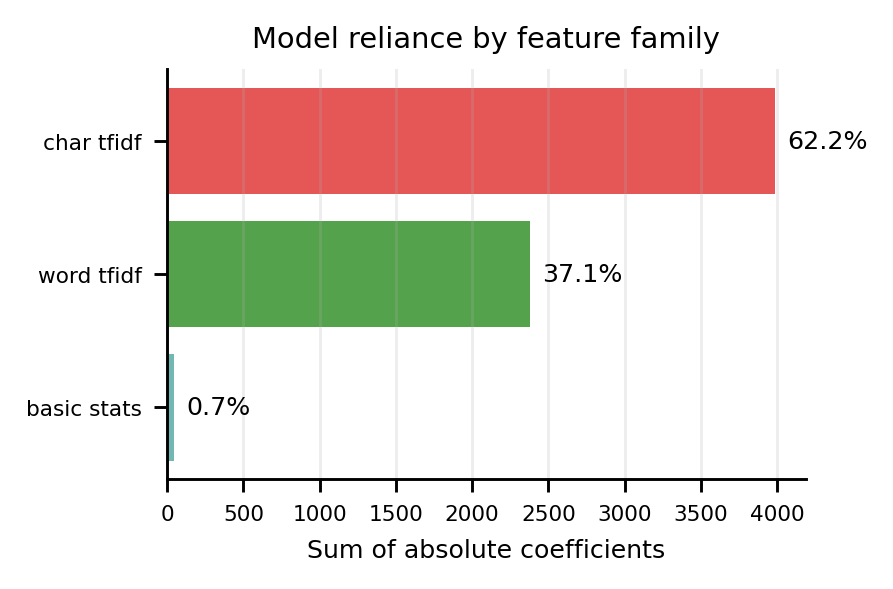

### Anchor Comparison and Baselines

The primary comparison baseline is the reproduced Alikhanov TF-IDF logistic-regression model. It uses word TF-IDF with unigrams and bigrams, English stop-word removal, logistic regression with the liblinear solver, five-fold cross-validation, vocabulary sizes of 15,000, 25,000, and 35,000, regularization strengths C = 0.1, 1, and 10, and L1/L2 penalties. The proposed extensions are evaluated on the same anchor train/validation/test rows: M1 adds character TF-IDF, and M2 adds character TF-IDF plus lexical/readability statistics.

The implementation writes the reproducible anchor artifacts to `reports/results/anchor_study_summary.csv`, `anchor_grid_results.csv`, `anchor_threshold_metrics.csv`, `anchor_stat_tests.csv`, `anchor_subgroup_fpr_ci.csv`, and `anchor_calibration_metrics.csv`. A full paper run should use these files for the same-row comparison table.

The secondary comparison includes three detector baselines on a fixed 500-row sample per evaluation set: a GLTR-style heuristic, an OpenAI-community RoBERTa GPT-2 detector, and the Hello-SimpleAI HC3 RoBERTa detector. The GLTR-style baseline uses GPT-2 token-rank statistics to construct a score. The transformer baselines use Hugging Face sequence-classification checkpoints [6], [7]. Baseline thresholds are calibrated on an HC3 validation sample to target the configured false-positive rate.

The baseline comparison is intentionally labeled as fixed-sample comparison. Full transformer inference over all 300,000 GPT-wiki-intro examples was not run, so the baseline results should not be interpreted as full-dataset transformer results.

### Conservative Education Policy

Because the default threshold produces severe false positives under domain shift, the project implements a conservative education policy. ICNALE is split by participant group into calibration and held-out audit partitions. A higher threshold is calibrated from pooled HC3 validation human text and ICNALE calibration human text, with special attention to learner-English human examples. The resulting education threshold is 0.9931.

The education policy should be interpreted as a manual-review policy, not as a high-recall detector. Scores below 0.4563 are treated as human-written by the default threshold. Scores from 0.4563 to 0.9931 fall into a review zone. Scores above 0.9931 are the only cases classified as AI-generated under the conservative policy.

## Evaluation Metrics

For binary datasets, the project reports accuracy, F1-macro, human-class F1, AI-class F1, AUROC, AUPR, confusion matrices, false-positive rate (FPR), false-negative rate (FNR), true-positive rate (TPR), and TPR at FPR <= 1 percent. Accuracy is included because Alikhanov et al. report it as their primary metric. For human-only ICNALE fairness data, AUROC, AUPR, F1, and TPR are undefined; the paper reports human FPR, human recall, subgroup FPR, and confidence intervals for groups of at least 30.

Bootstrap confidence intervals, McNemar paired tests, paired bootstrap AUROC comparisons, Brier score, expected calibration error, and Platt/isotonic score calibration are implemented in the anchor-study pipeline. The currently reported legacy HC3/GPT-wiki/ICNALE tables remain point estimates unless regenerated with bootstrap iterations enabled.

## Results

### Alikhanov Anchor-Study Results

TABLE II reports the same-row anchor comparison on the Alikhanov et al. HC3+DAIGT v2 topic test split. M0 exactly reproduces the anchor paper's TF-IDF logistic-regression setup. It obtains 0.8286 accuracy, which is within 0.5 percentage points of the 82.87 percent reported by Alikhanov et al. The reproduced confusion counts also match the paper's reported pattern: 1,638 human false positives and 644 missed AI samples at the default decision threshold.

| Model | Default accuracy | Default macro-F1 | AUROC | Default FPR | Default TPR | Val-target FPR | Val-target TPR |
|---|---:|---:|---:|---:|---:|---:|---:|
| M0 Alikhanov TF-IDF-LR | 0.8286 | 0.7987 | 0.9121 | 0.1686 | 0.8208 | 0.0135 | 0.4157 |
| M1 Word+Char LR | 0.7887 | 0.7713 | 0.9450 | 0.2704 | 0.9485 | 0.0123 | 0.5607 |
| M2 Word+Char+Stats LR | 0.7515 | 0.7357 | 0.9311 | 0.3179 | 0.9391 | 0.0288 | 0.6430 |

The best reproduced M0 parameters were C = 10, L2 regularization, and 35,000 TF-IDF features. M1 improved ranking performance, with AUROC increasing from 0.9121 to 0.9450, but its default 0.5 threshold increased human false positives. M2 produced the highest validation-target AI recall on the anchor test set, but its test false-positive rate at the validation-selected threshold rose to 0.0288. These results show why threshold policy must be reported with any feature-extension claim.

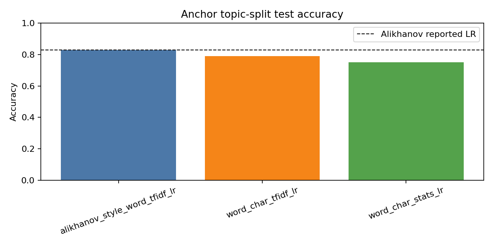

Paired tests support that the feature extensions change model behavior on the same anchor test rows. Compared with M0 at the default threshold, M1 improved AUROC by 0.0329 with a 95 percent paired bootstrap interval of [0.0283, 0.0377], and M2 improved AUROC by 0.0190 with interval [0.0137, 0.0247]. McNemar tests were significant for both M1 and M2, indicating that their errors are not interchangeable with the reproduced baseline.

TABLE III reports transfer behavior under the validation-target FPR threshold. M1 and M2 improve HC3 group-test recall compared with M0, but GPT-wiki-intro and ICNALE show that the extra feature families do not guarantee safer deployment. In particular, M2 increases GPT-wiki-intro recall but at the cost of a much higher human false-positive rate.

| Model | Evaluation set | Accuracy | Macro-F1 | FPR | TPR |
|---|---|---:|---:|---:|---:|
| M0 Alikhanov TF-IDF-LR | Current HC3 group test | 0.8598 | 0.8109 | 0.0001 | 0.5562 |
| M0 Alikhanov TF-IDF-LR | GPT-wiki-intro OOD | 0.5354 | 0.4267 | 0.0293 | 0.1001 |
| M0 Alikhanov TF-IDF-LR | ICNALE audit | 0.9605 | N/A | 0.0395 | N/A |
| M1 Word+Char LR | Current HC3 group test | 0.9352 | 0.9203 | 0.0009 | 0.7967 |
| M1 Word+Char LR | GPT-wiki-intro OOD | 0.5761 | 0.5158 | 0.0709 | 0.2231 |
| M1 Word+Char LR | ICNALE audit | 0.9556 | N/A | 0.0444 | N/A |
| M2 Word+Char+Stats LR | Current HC3 group test | 0.9580 | 0.9496 | 0.0017 | 0.8707 |
| M2 Word+Char+Stats LR | GPT-wiki-intro OOD | 0.6466 | 0.6465 | 0.3685 | 0.6618 |
| M2 Word+Char+Stats LR | ICNALE audit | 0.9481 | N/A | 0.0519 | N/A |

The conservative review threshold greatly reduces ICNALE false positives. Under that threshold, M1 and M2 have slightly lower learner-English false-positive rates than the reproduced baseline, while both classify zero native-speaker essays as AI in the held-out ICNALE audit sample.

| Model | Group | N human | False positives | FPR | 95% CI |
|---|---|---:|---:|---:|---:|
| M0 Alikhanov TF-IDF-LR | Learner | 5,418 | 60 | 0.0111 | [0.0086, 0.0142] |
| M0 Alikhanov TF-IDF-LR | Native | 280 | 1 | 0.0036 | [0.0006, 0.0199] |
| M1 Word+Char LR | Learner | 5,418 | 47 | 0.0087 | [0.0065, 0.0115] |
| M1 Word+Char LR | Native | 280 | 0 | 0.0000 | [0.0000, 0.0135] |
| M2 Word+Char+Stats LR | Learner | 5,418 | 46 | 0.0085 | [0.0064, 0.0113] |
| M2 Word+Char+Stats LR | Native | 280 | 0 | 0.0000 | [0.0000, 0.0135] |

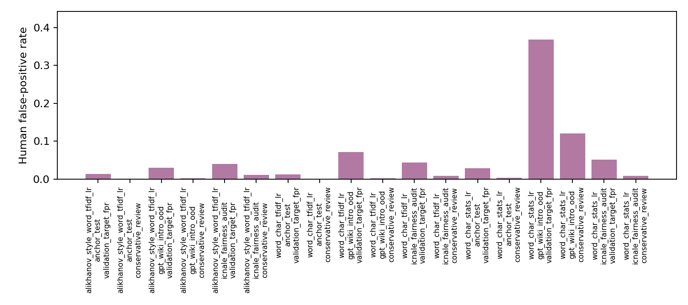

The anchor-study calibration diagnostics show that raw logistic-regression scores are not automatically calibrated probabilities. On the anchor test set, M0 raw scores had Brier score 0.1218 and ECE 0.0932; Platt scaling improved these to 0.1109 and 0.0639, while isotonic calibration improved them to 0.1043 and 0.0441. Therefore, threshold selection and probability calibration are reported as distinct procedures.

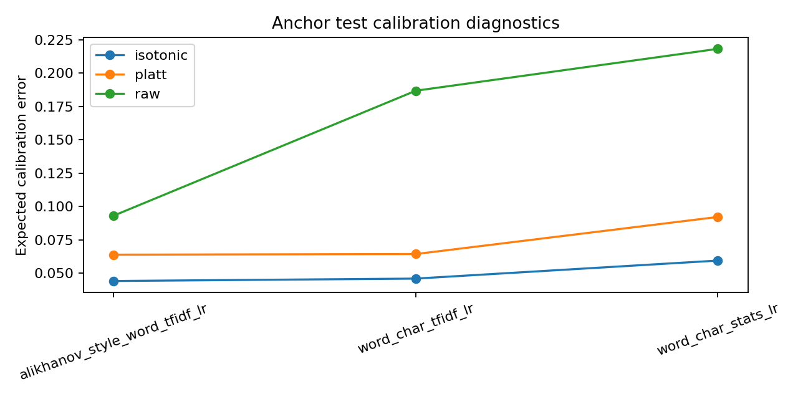

Leave-one-domain-out HC3 experiments confirm split sensitivity. Performance varies sharply by held-out source, especially when finance is the target domain for models with character/statistical features. This supports Alikhanov et al.'s warning that topic-aware evaluation is necessary and shows that feature additions should be stress-tested by source.

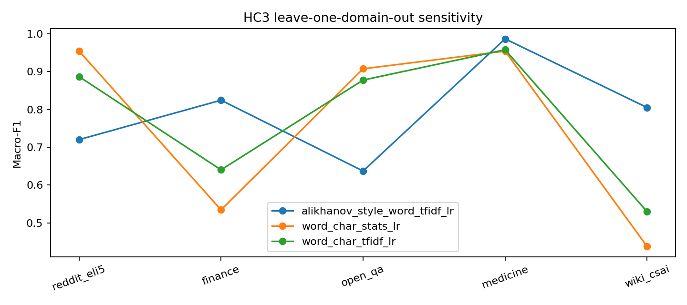

Grouped permutation importance on the anchor test set supports a more cautious interpretability claim than raw coefficient mass. For M2, permuting word TF-IDF caused the largest macro-F1 drop, followed by character TF-IDF and basic statistics. The interpretability conclusion is therefore based on ablation/permutation behavior rather than coefficient mass alone.

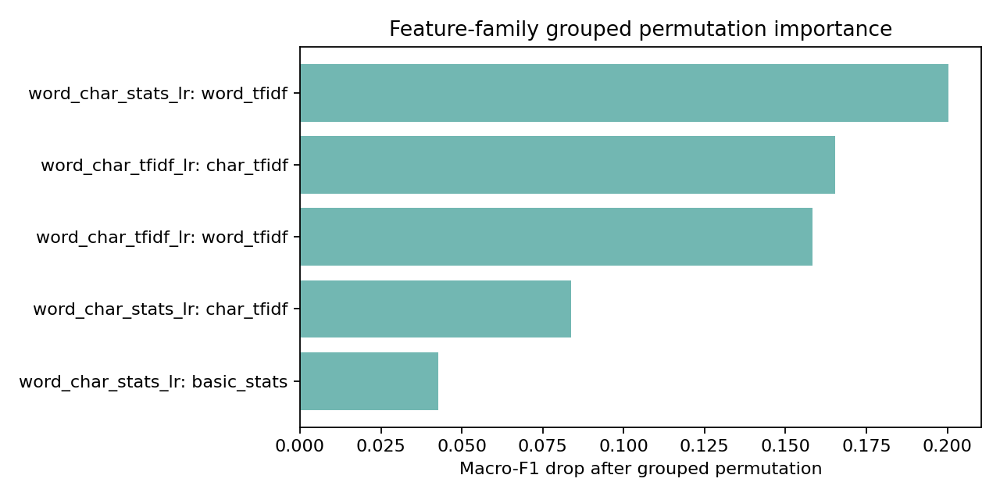

### Full-Data Classical Results

TABLE IV reports the main full-data evaluation for the original HC3-trained classical logistic-regression model under the default HC3-calibrated threshold.

| Set | N | F1 | AUROC | FPR | TPR |
|---|---:|---:|---:|---:|---:|
| HC3 test | 12,837 | 0.9874 | 0.9992 | 0.0128 | 0.9928 |
| GPT-wiki OOD | 300,000 | 0.5043 | 0.7902 | 0.7999 | 0.9466 |
| ICNALE | 8,140 | N/A | N/A | 0.7773 | N/A |

Figure 7 shows the HC3 test confusion matrix at the default validation-calibrated threshold. The model correctly classifies most HC3 human and AI examples, with 112 false positives among 8,783 human examples and 29 false negatives among 4,054 AI examples.

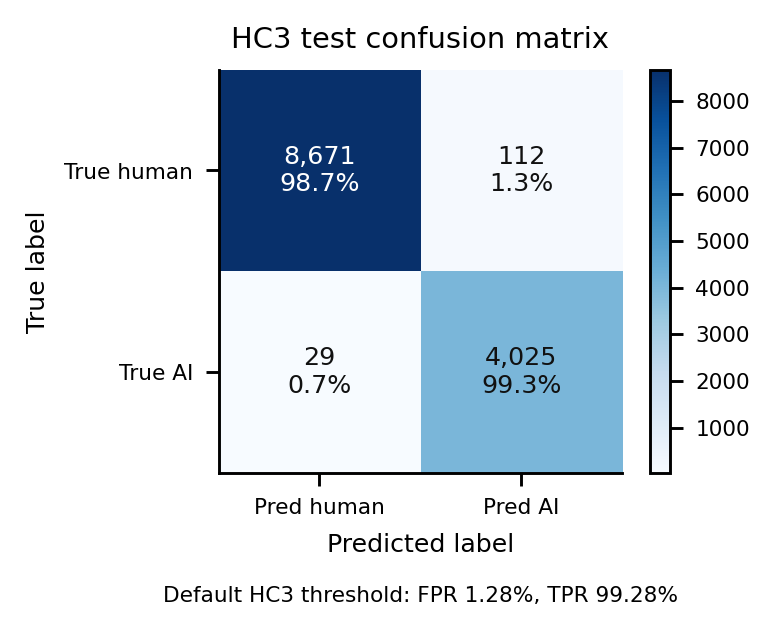

The model performs strongly on the in-domain HC3 test split, but the default threshold does not transfer. GPT-wiki-intro human FPR is 0.7999, and ICNALE human-only FPR is 0.7773. These rates show that HC3 validation calibration is unsafe for Wikipedia-style text and learner-English essays.

These HC3-only results must not be described as outperforming Alikhanov et al.'s 82.87 percent logistic-regression result. The training data, split, feature set, class balance, and threshold rule differ. The correct direct comparison is the anchor-study M0/M1/M2 table generated by `aidetect anchor-study`, where M0 reproduces the Alikhanov baseline and M1/M2 are evaluated on the identical rows.

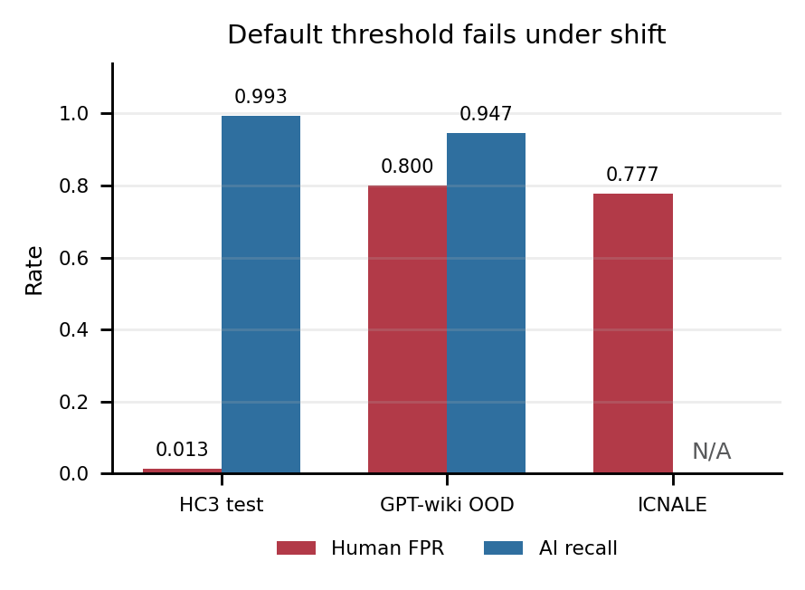

Figure 9 shows the score-distribution reason for this failure. HC3 human and AI examples are mostly separated, but GPT-wiki human text and ICNALE human essays receive high AI scores, placing many human samples above the default threshold.

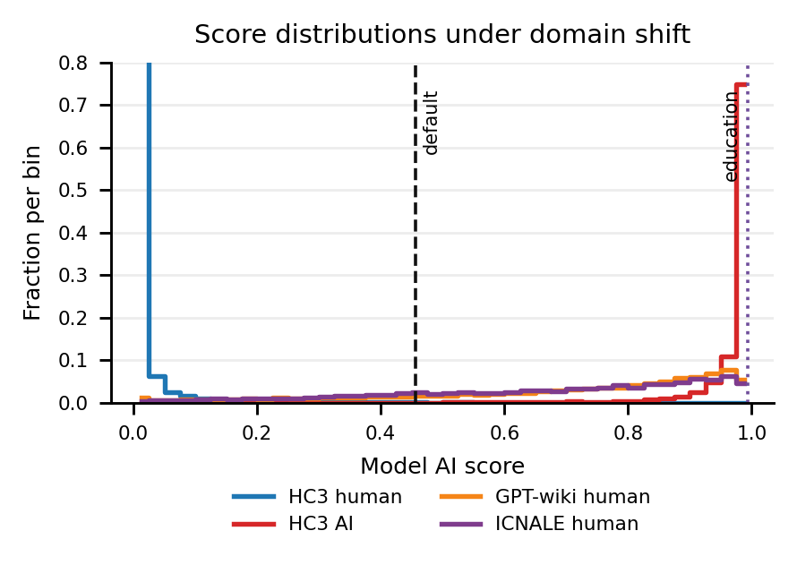

### Native and Learner-English False Positives

The ICNALE full-data fairness summary shows 254 false positives among 400 native-speaker essays and 6,073 false positives among 7,740 learner essays. The native-speaker FPR is 0.6350, while the learner-English FPR is 0.7846. The learner-minus-native gap is 0.1496.

Because TOEFL data were unavailable, this is not a direct reproduction of Liang et al. It nevertheless supports the same concern: excellent benchmark performance can coexist with high false-positive rates for human learner writing.

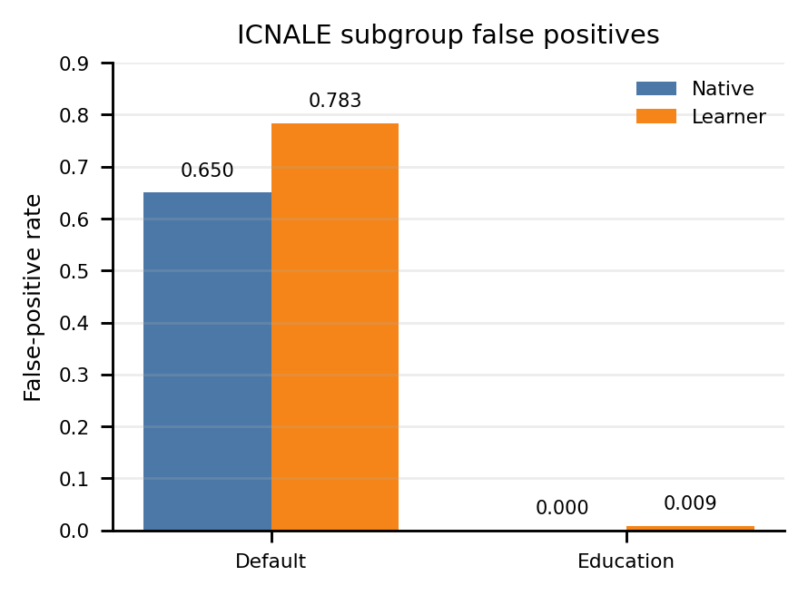

### Calibrated Education Policy

TABLE V compares the default threshold with the conservative education threshold.

| Set | Policy | FPR | TPR |
|---|---|---:|---:|
| HC3 test | Default | 0.0128 | 0.9928 |
| HC3 test | Education | 0.0000 | 0.4748 |
| GPT-wiki-intro OOD | Default | 0.7999 | 0.9466 |
| GPT-wiki-intro OOD | Education | 0.0068 | 0.1644 |
| ICNALE audit | Default | 0.7769 | N/A |
| ICNALE audit | Education | 0.0086 | N/A |

The education threshold sharply reduces false positives. On the held-out ICNALE audit split, FPR falls from 0.7769 to 0.0086. Learner FPR falls to 0.0090, and native FPR is 0.0000. However, the cost is severe: HC3 test TPR drops from 0.9928 to 0.4748, and GPT-wiki-intro TPR drops from 0.9466 to 0.1644. This tradeoff means the education policy is safer for avoiding accusations, but weak as a binary detector.

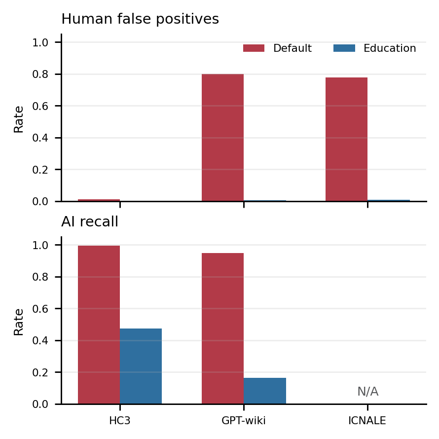

### Fixed-Sample Baseline Comparison

TABLE VI reports the same-row 500-example comparison for the classical detector and baselines. These results are useful for approximate comparison, but they are not full-dataset transformer results.

| Model | Set | FPR | TPR | Learner FPR |
|---|---|---:|---:|---:|
| Classical default | HC3 | 0.000 | 0.996 | N/A |
| Classical default | GPT-wiki | 0.724 | 0.948 | N/A |
| Classical default | ICNALE | 0.738 | N/A | 0.812 |
| Classical education | ICNALE | 0.002 | N/A | 0.004 |
| GLTR heuristic | ICNALE | 0.208 | N/A | 0.096 |
| OpenAI RoBERTa | ICNALE | 0.118 | N/A | 0.052 |
| HC3 RoBERTa | ICNALE | 0.562 | N/A | 0.608 |

On the fixed ICNALE sample, the OpenAI RoBERTa GPT-2 detector has lower false-positive rates than the default classical detector, and the GLTR heuristic also has lower ICNALE FPR than the default classical detector. The HC3 RoBERTa detector remains high on ICNALE. The conservative classical policy has the lowest ICNALE FPR, but this comes from raising the decision threshold and sacrificing recall on binary datasets.

### Feature Ablation Summary

Feature ablations show that strong in-domain accuracy does not align cleanly with fairness safety. Word TF-IDF alone has HC3 test F1-macro 0.9724 and ICNALE FPR 0.1558. Basic lexical statistics alone have lower HC3 test F1-macro 0.7815 but ICNALE FPR 0.1061. The combined word, character, and statistics model has HC3 test F1-macro 0.9874 but ICNALE FPR 0.7773. This indicates that feature combinations that improve benchmark detection can also amplify false positives under distribution shift.

This result is not a reason to prefer a weak model. Instead, it shows why detector development must evaluate both predictive performance and human false-positive risk before recommending any threshold for educational use.

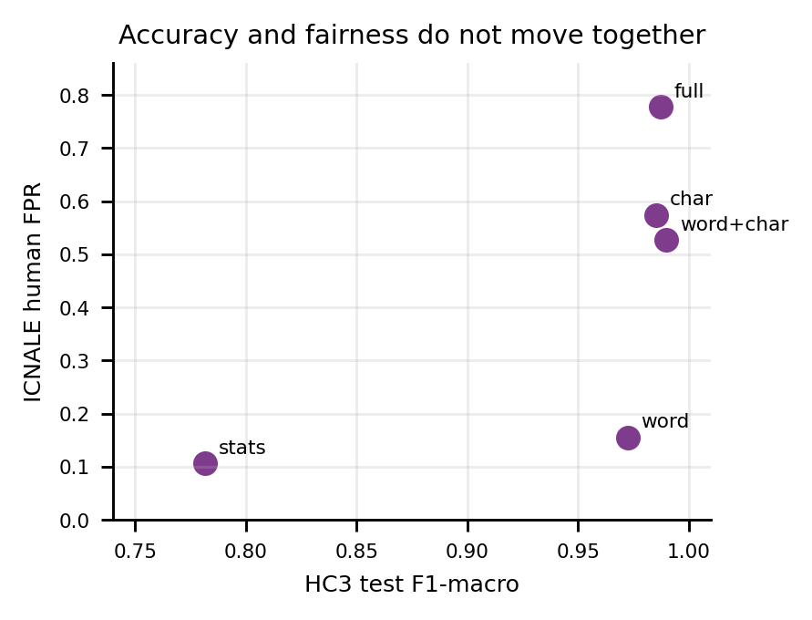

### Comparison with Prior Work

Alikhanov et al. is the main direct comparison for this paper because it uses the same broad data family and the same TF-IDF logistic-regression baseline under a topic-held-out protocol [17]. Their reported 82.87 percent logistic-regression accuracy is not directly comparable to the HC3-only F1-macro of 0.9874 in TABLE IV, because TABLE IV uses HC3 only, group-based splits within HC3 domains, additional character/statistical features, and a validation threshold targeting low false-positive rate. The direct comparison is TABLE II, where M0 reproduces the Alikhanov baseline and M1/M2 are evaluated on the same HC3+DAIGT topic split.

The HC3 test results demonstrate that the classical model can fit its training distribution extremely well, obtaining an F1-macro of 0.9874 and AUROC of 0.9992. This result is consistent with prior supervised detectors that report very high benchmark performance, including Ghostbuster [9]. However, broad numerical comparison is inappropriate when studies use different datasets, generators, prompts, document lengths, thresholds, and evaluation protocols.

The more informative comparison concerns generalization. Under the HC3-calibrated threshold, the model's GPT-wiki-intro human false-positive rate rises to 0.7999 and its ICNALE human false-positive rate rises to 0.7773. This supports the broader conclusion of M4 and RAID that detector performance can deteriorate sharply under unseen domains, models, and evaluation conditions [10], [11]. In this study, the failure is especially serious because shifted human text is frequently classified as AI-generated, creating a direct risk of false accusation.

The ICNALE result is directionally consistent with Liang et al. [1]. The default detector produces a false-positive rate of 0.7846 for learner-English essays and 0.6350 for native-speaker essays. Liang et al. also observed higher false-positive rates for non-native writing. However, the exact percentages should not be compared directly because TOEFL and ICNALE differ in participant populations, prompts, proficiency distributions, text sources, detector families, thresholds, and evaluation procedures.

The findings also help explain the apparently different result reported by Jiang et al. [16]. Their study was developed in a large-scale writing-assessment setting and reported no evidence of bias against non-native speakers. In contrast, the present detector was trained on HC3 answers rather than learner essays. The difference suggests that population and task alignment may be more important for fairness than high benchmark accuracy alone.

The conservative education threshold reduces the held-out ICNALE false-positive rate from 0.7769 to 0.0086. This demonstrates that target-population calibration can reduce harm, consistent with the importance of deployment-aligned data shown by Jiang et al. [16]. Nevertheless, the policy reduces HC3 AI recall to 0.4748 and GPT-wiki-intro AI recall to 0.1644. It therefore represents a risk-management policy rather than a competitive high-recall detector. A controlled comparison with Ghostbuster, Binoculars, DetectGPT, and other methods would require running all models on the same HC3, GPT-wiki-intro, and ICNALE samples under identical false-positive-rate targets.

Binoculars reported detecting more than 90 percent of generated samples at a 0.01 percent false-positive rate across its evaluation settings [12]. By comparison, the low recall of the conservative policy in this project indicates that threshold adjustment cannot fully compensate for weak separation between shifted human and AI score distributions.

## Discussion

The most important finding is that in-domain success is misleading. On HC3, the classical logistic-regression detector appears excellent. It has high F1, AUROC, AUPR, and recall at a low false-positive target. Yet the same model fails on GPT-wiki-intro and ICNALE under the default threshold. The failure is not small; it is large enough to make the default detector inappropriate for direct academic-integrity decisions.

The likely reason is distribution shift. HC3 answers differ from Wikipedia introductions and from learner essays in length, topic, punctuation, discourse style, and lexical patterns. Logistic regression with high-dimensional n-grams can learn patterns that separate HC3 human and ChatGPT answers, but those patterns do not necessarily represent the general distinction between human and AI writing. The feature-family ablations and grouped diagnostics support this caution because character n-grams can improve benchmark performance while also capturing dataset-specific style artifacts.

The fairness result is also important. The ICNALE learner false-positive rate is higher than the native false-positive rate under the default threshold. Even though this project did not use TOEFL data, the ICNALE audit supports the broader concern from Liang et al. that AI-text detectors can penalize non-native or learner-English writing [1]. The exact rates should not be compared directly across TOEFL and ICNALE because the corpora differ.

The conservative education policy demonstrates one practical mitigation: calibrate a higher threshold using human writing from the target population and treat mid-range scores as manual review. This reduces ICNALE false positives to near the target rate. However, the price is much lower recall for AI-generated text. Therefore, a conservative threshold can make the tool less harmful, but it cannot make it a definitive detector.

## Demo and Interpretability

The project includes a Gradio demo that accepts text, returns an AI score, shows the default and education thresholds, labels the review zone, and lists feature contributions. Explanations are computed from logistic-regression feature contributions. The demo also warns users when input text is short, because short text is less reliable for detection.

The interpretability layer is useful for transparency, but it has limits. A feature contribution is not a causal explanation of authorship. It shows which learned features pushed the score up or down for the trained model. In a real educational workflow, such explanations should support careful review, not replace human judgment.

## Limitations

The first limitation is data access. The project could not obtain the TOEFL dataset because the relevant access is paid or restricted. ICNALE is a reasonable fallback for learner-English false-positive auditing, but it is not a direct reproduction of the TOEFL experiment.

Second, ICNALE is human-only in this project. It supports false-positive analysis but cannot measure AI recall for learner-English prompts.

Third, transformer baselines were evaluated only on fixed samples for paper comparison. Full transformer inference on all 300,000 GPT-wiki-intro examples was not run.

Fourth, the reported final classical model does not include optional spaCy POS/NER/syntax features or GPT-2 perplexity features. These components exist in the implementation but are not part of the saved final model.

Fifth, the legacy full-data HC3/GPT-wiki/ICNALE tables report point estimates without bootstrap confidence intervals. The anchor-study tables include bootstrap intervals and paired tests, so strong claims about small differences should be based on the anchor-study outputs rather than the older point-estimate-only tables.

Sixth, the evaluation does not test adversarially paraphrased, human-edited, translated, or mixed human-AI text. Prior research has shown that paraphrasing can substantially reduce the effectiveness of several detector families; therefore, the reported out-of-domain results represent natural distribution shift rather than adversarial robustness [13], [14].

Finally, WEP includes a corpus-specific caveat: participants declared that they did not use writing-support tools, but the ICNALE team notes that influence from such tools cannot be fully guaranteed for at-home writing. This does not invalidate the audit, but it should be disclosed.

## Conclusion

This project implemented an interpretable and bias-aware AI-generated text detection pipeline using classical NLP features and logistic regression. It reproduces Alikhanov et al.'s HC3+DAIGT TF-IDF logistic-regression baseline within the reported accuracy tolerance, then evaluates word/character/statistical feature extensions on the same rows. The extensions improve ranking and some low-FPR recall measures, but they also expose threshold sensitivity and false-positive tradeoffs under domain and population shift. The detector performs very well on the HC3 in-domain test split, but the broader results show false-positive failures on GPT-wiki-intro and ICNALE under default thresholds. A conservative education threshold greatly reduces false positives on ICNALE, but also reduces AI recall. The main conclusion is therefore cautious: AI-text detectors should not be used as automatic evidence of misconduct, especially for learner-English writers. If used at all, they should be calibrated on target-domain human writing, framed as decision support, and paired with manual review.

## References

[1] W. Liang, M. Yuksekgonul, Y. Mao, E. Wu, and J. Zou, "GPT detectors are biased against non-native English writers," Patterns, vol. 4, no. 7, art. 100779, 2023, doi: 10.1016/j.patter.2023.100779.

[2] B. Guo, X. Zhang, Z. Wang, M. Jiang, J. Nie, Y. Ding, J. Yue, and Y. Wu, "How close is ChatGPT to human experts? Comparison corpus, evaluation, and detection," arXiv:2301.07597, 2023.

[3] S. Gehrmann, H. Strobelt, and A. M. Rush, "GLTR: Statistical detection and visualization of generated text," in Proc. 57th Annual Meeting of the Association for Computational Linguistics: System Demonstrations, 2019, pp. 111-116.

[4] A. Bhat, "GPT-wiki-intro," Hugging Face dataset repository, 2023, doi: 10.57967/hf/0326. [Online]. Available: https://huggingface.co/datasets/aadityaubhat/GPT-wiki-intro

[5] S. Ishikawa, The ICNALE Guide: An Introduction to a Learner Corpus Study on Asian Learners' L2 English. London, U.K.: Routledge, 2023.

[6] OpenAI Community, "roberta-base-openai-detector," Hugging Face model repository. [Online]. Available: https://huggingface.co/openai-community/roberta-base-openai-detector

[7] Hello-SimpleAI, "chatgpt-detector-roberta," Hugging Face model repository. [Online]. Available: https://huggingface.co/Hello-SimpleAI/chatgpt-detector-roberta

[8] E. Mitchell, Y. Lee, A. Khazatsky, C. D. Manning, and C. Finn, "DetectGPT: Zero-shot machine-generated text detection using probability curvature," in Proc. 40th Int. Conf. Machine Learning, vol. 202, 2023, pp. 24950-24962.

[9] V. Verma, E. Fleisig, N. Tomlin, and D. Klein, "Ghostbuster: Detecting text ghostwritten by large language models," in Proc. 2024 Conf. North American Chapter of the Association for Computational Linguistics: Human Language Technologies, 2024, pp. 1702-1717, doi: 10.18653/v1/2024.naacl-long.95.

[10] Y. Wang et al., "M4: Multi-generator, multi-domain, and multi-lingual black-box machine-generated text detection," in Proc. 18th Conf. European Chapter of the Association for Computational Linguistics, 2024, pp. 1369-1407, doi: 10.18653/v1/2024.eacl-long.83.

[11] L. Dugan et al., "RAID: A shared benchmark for robust evaluation of machine-generated text detectors," in Proc. 62nd Annual Meeting of the Association for Computational Linguistics, 2024, pp. 12463-12492, doi: 10.18653/v1/2024.acl-long.674.

[12] A. Hans et al., "Spotting LLMs with Binoculars: Zero-shot detection of machine-generated text," in Proc. 41st Int. Conf. Machine Learning, vol. 235, 2024, pp. 17519-17537.

[13] K. Krishna, Y. Song, M. Karpinska, J. Wieting, and M. Iyyer, "Paraphrasing evades detectors of AI-generated text, but retrieval is an effective defense," in Advances in Neural Information Processing Systems, vol. 36, 2023, pp. 27469-27500.

[14] V. S. Sadasivan, A. Kumar, S. Balasubramanian, W. Wang, and S. Feizi, "Can AI-generated text be reliably detected? Stress testing AI text detectors under various attacks," Transactions on Machine Learning Research, Jan. 2025.

[15] D. Weber-Wulff et al., "Testing of detection tools for AI-generated text," International Journal for Educational Integrity, vol. 19, art. no. 26, 2023, doi: 10.1007/s40979-023-00146-z.

[16] Y. Jiang, J. Hao, M. Fauss, and C. Li, "Detecting ChatGPT-generated essays in a large-scale writing assessment: Is there a bias against non-native English speakers?" Computers & Education, vol. 217, art. no. 105070, 2024, doi: 10.1016/j.compedu.2024.105070.

[17] A. Alikhanov, A. Amangeldi, D. Demeubay, D. Akhmetzhan, O. Polat, G. Zharas, and N. Moldakhmetov, "AI Generated Text Detection," arXiv:2601.03812, 2026.
