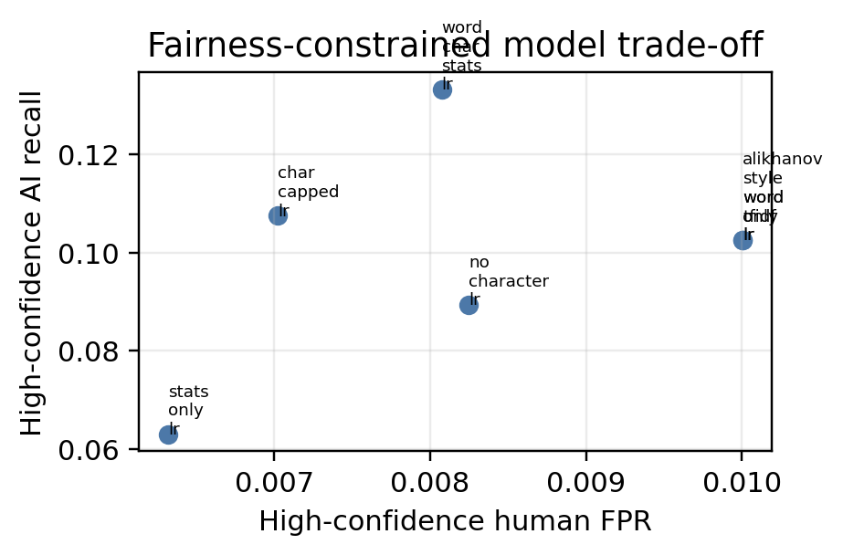
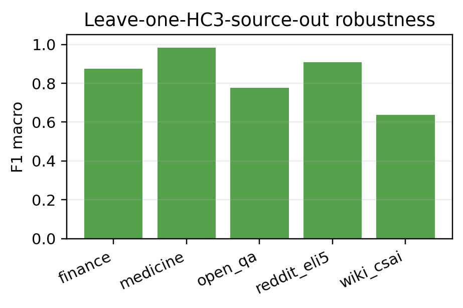
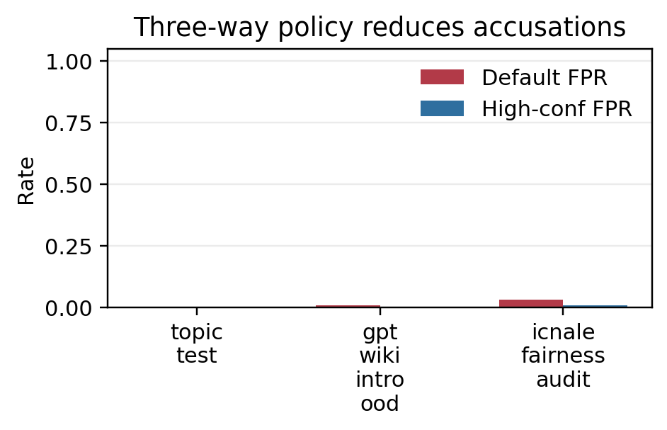
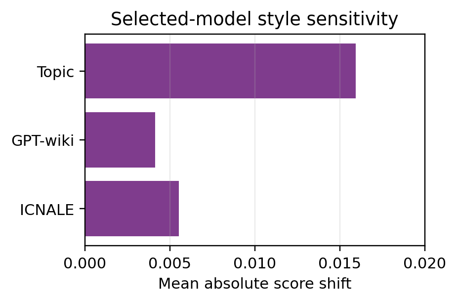

# A Fairness-Constrained Extension of HC3/DAIGT TF-IDF Logistic Regression for AI-Generated Text Detection

Authors: Ali Eissa - 23000798; Ammar Okla - 23000240; Anirudh Sengar - 23001546; Mohammed Kohanfekr - 23003266; Suleiman Altaf - 23001666

Affiliation: Department of Computer Science, British University in Dubai, Dubai, United Arab Emirates.

## Abstract

AI-generated text detection is often reported as a binary classification problem, but educational use requires a stricter standard: detectors must avoid falsely accusing human writers, especially learner-English writers. This paper turns our prior detector into a reproduction-and-extension study anchored on HC3 plus DAIGT v2 and the TF-IDF logistic-regression baseline used by Alikhanov et al. We reproduce the sparse word TF-IDF baseline under whole-topic splitting, then extend it with feature-family comparisons, leave-one-source-out robustness tests, ICNALE learner-English calibration, and a three-way selective policy. In the final DAIGT-inclusive run, the selected word+character+statistics logistic model satisfies pooled-human and learner-human calibration constraints at 1 percent FPR. On the held-out ICNALE audit, high-confidence AI false positives fall from 3.05 percent at the default threshold to 0.81 percent, with learner-English FPR of 0.85 percent. On the full 300,000-row GPT-wiki-intro set, high-confidence FPR is 0.058 percent, but high-confidence AI recall is only 2.82 percent. The contribution is therefore not state-of-the-art raw detection accuracy. It is an interpretable, artifact-backed framework for reducing accusation risk through selective deployment.

## Keywords

AI-generated text detection, HC3, DAIGT v2, logistic regression, TF-IDF, selective classification, learner English, fairness, ICNALE

## Introduction

AI writing tools create a difficult academic-integrity problem. A detector may identify some AI-generated text, but a false positive can place a real student under suspicion. This risk is particularly serious for non-native and learner-English writers, whose writing style can differ from the native-speaker or benchmark distributions that many detectors implicitly learn.

Our original draft implemented an interpretable HC3-trained detector and showed a strong but incomplete result: logistic regression over word TF-IDF, character TF-IDF, and lexical statistics performed very well on an HC3 held-out split, but produced severe false positives on GPT-wiki-intro and ICNALE learner-English essays. That draft was useful as an engineering report, but it did not fully satisfy the expected research pattern: reproduce or build from an existing paper using a similar dataset and model, then modify the method and evaluate the improvement.

This revision uses that expected pattern. The anchor is the recent HC3 and DAIGT v2 AI-text-detection study by Alikhanov et al. [1], which reports a TF-IDF logistic-regression baseline under topic-based splitting. We treat that as the closest same-dataset and same-model-family prior work. We then extend it in four research questions:

1. How does an Alikhanov-style word TF-IDF logistic-regression baseline behave under topic/source holdout?
2. Which interpretable feature families improve in-domain accuracy, and which increase false positives under shifted human writing?
3. Can a fairness-constrained selective policy reduce learner-English false positives while preserving useful high-confidence AI recall?
4. How stable are sparse detector scores under source/topic shift and deterministic style-only text variants?

The resulting paper is positioned as a safety and robustness extension of a sparse detector baseline, not as a transformer leaderboard paper.

## Related Work

HC3 introduced the Human ChatGPT Comparison Corpus and released detection systems for distinguishing human and ChatGPT answers [2]. Guo et al. also provide the dataset lineage used by our project. Because HC3 is a question-answering corpus collected early in the ChatGPT period, high HC3 performance alone does not establish reliable educational deployment.

Alikhanov et al. provide the closest reproduction anchor for this study [1]. Their work uses HC3 and DAIGT v2, applies topic-based splitting to reduce information leakage, and reports TF-IDF logistic regression as a classical baseline alongside BiLSTM and DistilBERT models. DAIGT v2 is used here through the public train_v2_drcat_02.csv release [9]. Our extension keeps the classical sparse model family but changes the objective from raw binary accuracy to deployment-aware selective classification and fairness auditing.

Fairness concerns are motivated by Liang et al., who found that GPT detectors can misclassify non-native English writing as AI-generated [3]. Jiang et al. report a different result in a large-scale writing-assessment setting [7], which suggests that detector fairness depends strongly on data alignment, population representation, and threshold policy. ICNALE is therefore used here as a learner-English human audit, not as training data [8].

Robustness work further motivates the revised design. Ghostbuster shows that feature-based systems can remain competitive when features are chosen carefully [4], while M4 and RAID show that detectors often fail across unseen domains, generators, and attacks [5], [6]. These papers justify our source/topic holdout tests and the decision to report threshold transfer and review-zone behavior instead of only HC3 test accuracy.

## Data

The study uses four data sources. HC3 is the primary training and reproduction dataset and contributes 85,431 examples across finance, medicine, open QA, Reddit ELI5, and wiki CSAI sources. DAIGT v2 contributes 44,868 essay examples in the final reproduction run, with 27,371 human texts and 17,497 AI texts. GPT-wiki-intro is used as a 300,000-row out-of-domain binary evaluation set. ICNALE contributes 8,140 human essays for learner-English fairness analysis; 5,698 are reserved as the final audit split.

DAIGT v2 support is intentionally strict. The expected local file is data/raw/daigt_v2/train_v2_drcat_02.csv, with required columns text and label, plus optional prompt_name and source. If the file is absent, the full reproduction run fails with an actionable message; smoke runs may use --skip-daigt. The final reported run includes DAIGT v2.

ICNALE remains human-only in this project. It supports false-positive and subgroup analysis but cannot measure AI recall for learner-English prompts. The ICNALE calibration split is used only to choose the selective high-confidence threshold. The held-out ICNALE audit split is never used for training or model selection.

## Methodology

### Reproduction Baseline

The reproduction track trains an Alikhanov-style word TF-IDF logistic-regression model under whole-topic splitting. For HC3, topics are derived from the source/domain field. For DAIGT v2, topics are derived from prompt_name when available, otherwise source. Entire topics are assigned to train, validation, or test partitions so the test split contains unseen topical groups.

### Model Variants

The comparison includes fixed sparse logistic-regression variants: Alikhanov-style word TF-IDF, word-only TF-IDF, the current word+character+statistics model, no-character word+statistics, statistics-only, and a character-capped full model. These variants are intentionally interpretable and CPU-friendly. Elastic-net regularization is supported by the code as an optional heavier ablation, but it is not required for the default final study.

The final modified model is selected by validation high-confidence AI recall, subject to human false-positive constraints. The constraints are pooled calibration human FPR <= 1 percent and ICNALE learner calibration FPR <= 1 percent.

### Selective Policy

The revised detector uses a three-way policy rather than a single accusation threshold. Scores below the low threshold are classified as human. Scores between the low and high thresholds enter a manual-review zone. Scores above the high threshold are high-confidence AI. The low threshold is the validation-calibrated detector threshold. The high threshold is calibrated from held-out human writing, including learner-English calibration examples when ICNALE is available.

This policy reports coverage, review-zone rate, selective risk, high-confidence AI recall, high-confidence human FPR, native and learner subgroup FPR, and bootstrap confidence intervals.

The selected model is chosen by validation high-confidence AI recall subject to both calibration constraints. The held-out ICNALE audit rows are never used for training, threshold selection, or model selection. Bootstrap confidence intervals use 1,000 resamples in the final run; for the 300,000-row GPT-wiki-intro set, resampling is capped at 20,000 examples for feasible CPU execution.

### Style-Invariance Audit

The style audit uses deterministic transformations only: whitespace normalization, quote normalization, punctuation normalization, and a combined style-normalized variant. It also compares character-heavy and character-reduced model variants. The goal is to measure score sensitivity to surface style changes without introducing external LLM-generated counterfactuals.

## Results

TABLE I summarizes the selected model's behavior from the latest paper-study run.

{{paper_study_summary_table}}

The selected model is the word+character+statistics logistic-regression variant. On the topic-held-out test set, the high-confidence threshold preserves zero observed human false positives and labels 13.33 percent of AI texts as high-confidence AI. On the full GPT-wiki-intro out-of-domain set, the default-threshold FPR is 0.86 percent and high-confidence FPR is 0.058 percent, with bootstrap 95 percent CI from 0.020 to 0.111 percent. The cost is low high-confidence AI recall: 2.82 percent on GPT-wiki-intro, with bootstrap 95 percent CI from 2.36 to 2.97 percent. On the ICNALE fairness audit, high-confidence FPR is 0.81 percent, with bootstrap 95 percent CI from 0.58 to 1.05 percent.

Figure 1 shows the model-family trade-off between high-confidence AI recall and high-confidence human false positives.

TABLE II reports the learned selective thresholds and calibration outcomes for each sparse model family.

{{selective_policy_table}}

All reported sparse variants satisfy the pooled-human and learner-human calibration constraints. The selected word+character+statistics model has the highest validation high-confidence AI recall among constrained variants, 51.76 percent, with pooled calibration FPR of 0.48 percent and learner calibration FPR of 0.99 percent. This selection rule favors safer high-confidence decisions over raw recall.

TABLE III reports leave-one-HC3-source-out robustness for the word+character+statistics model. These results test whether the detector has learned general authorship signals or source-specific artifacts.

{{topic_holdout_table}}

The source-holdout results show that topic transfer remains the hardest failure mode. Medicine and Reddit ELI5 transfer reasonably well, but finance produces a 22.70 percent human FPR and wiki CSAI produces a 64.85 percent human FPR. This is why the paper treats source-shift robustness as an open deployment risk rather than as solved by the selective policy.

Figure 3 compares default-threshold false positives with high-confidence false positives for the selected model. The important change is conceptual: mid-range cases are no longer treated as automatic accusations.

TABLE IV reports deterministic style-invariance sensitivity. Lower score shifts and lower decision-flip rates are preferable, especially for human text.

{{style_invariance_table}}

For the selected model, deterministic style normalization produces small average score shifts in the 1,000-row style audit samples: 0.0159 on topic test, 0.0041 on GPT-wiki-intro, and 0.0055 on ICNALE. Decision flips remain at or below 0.1 percent in these samples. Character features still increase sensitivity to punctuation changes compared with no-character variants, so character evidence should be interpreted as useful but style-sensitive.

## Discussion

The revised design is explicitly a reproduction-and-extension study. It begins from a concrete prior baseline, reproduces its dataset family and topic-split logic, and then adds a modification: fairness-constrained selective classification for sparse logistic detectors.

The key deployment insight is that a detector can have strong benchmark metrics while still being unsafe as an accusation tool. A selective policy changes the output semantics. It does not claim that every uncertain text is human or AI. Instead, it exposes uncertainty as a manual-review zone and reserves the AI label for high-confidence cases calibrated against human writing from the target population.

Feature-family comparisons are also important. Character n-grams improve validation high-confidence AI recall in the selected model, but they may encode style artifacts, punctuation habits, or corpus-specific formatting. The no-character and character-capped variants make this trade-off visible. The deterministic style audit gives a reproducible first test of whether surface edits move model scores.

The most important limitation is recall under distribution shift. On GPT-wiki-intro, the high-confidence AI label is very precise but covers only a small fraction of AI texts. This means the proposed modification is not a complete detector. It is a safer decision policy for cases where the model has unusually strong evidence. The model is useful only as decision support and should not be used as automatic proof of misconduct.

## Limitations

DAIGT v2 is a local external dataset and is not redistributed by this project. A full reproduction run requires the user to place the configured CSV file in the expected path.

ICNALE is human-only here, so it cannot measure recall on learner-English AI generations. It only audits false positives for human writing.

The transformer baselines are optional and may be sampled for feasibility. Any sampled baseline table must be labeled as sampled and should not be compared as if it were full-dataset inference.

The style-invariance audit is deterministic and lightweight. It does not replace a full counterfactual rewriting study or adversarial paraphrase benchmark.

Elastic-net logistic regression is implemented as an optional ablation but is excluded from the default final run because it is slow on large sparse matrices and does not change the main paper claim.

Leave-one-source-out results show that some HC3 sources do not transfer cleanly. Future work should expand calibration data by assignment type and writing population, evaluate paraphrase and adversarial robustness, and test whether selective policies remain stable for newer generator families.

## Conclusion

This study turns the project into a reproduction-and-extension paper. It uses HC3 and DAIGT v2 to reproduce a sparse TF-IDF logistic-regression baseline under topic splitting, then extends the baseline with feature-family ablations, source-holdout robustness, learner-English false-positive auditing, and a fairness-constrained three-way selective policy. The final run shows that sparse interpretable detectors can reduce high-confidence false accusations when thresholds are calibrated against target-population human writing. The same run also shows the cost: high-confidence AI recall falls sharply under out-of-domain shift. The appropriate claim is therefore harm reduction and more careful deployment, not automatic authorship judgment.

## References

[1] A. Alikhanov, A. Amangeldi, D. Demeubay, D. Akhmetzhan, N. Moldakhmetov, O. Polat, and G. Zharas, "AI Generated Text Detection," arXiv:2601.03812, 2026.

[2] B. Guo, X. Zhang, Z. Wang, M. Jiang, J. Nie, Y. Ding, J. Yue, and Y. Wu, "How Close is ChatGPT to Human Experts? Comparison Corpus, Evaluation, and Detection," arXiv:2301.07597, 2023.

[3] W. Liang, M. Yuksekgonul, Y. Mao, E. Wu, and J. Zou, "GPT detectors are biased against non-native English writers," Patterns, vol. 4, no. 7, art. 100779, 2023, doi: 10.1016/j.patter.2023.100779.

[4] V. Verma, E. Fleisig, N. Tomlin, and D. Klein, "Ghostbuster: Detecting Text Ghostwritten by Large Language Models," in Proc. 2024 Conf. North American Chapter of the Association for Computational Linguistics: Human Language Technologies, 2024, pp. 1702-1717, doi: 10.18653/v1/2024.naacl-long.95.

[5] Y. Wang et al., "M4: Multi-generator, Multi-domain, and Multi-lingual Black-Box Machine-Generated Text Detection," in Proc. 18th Conf. European Chapter of the Association for Computational Linguistics, 2024, pp. 1369-1407, doi: 10.18653/v1/2024.eacl-long.83.

[6] L. Dugan et al., "RAID: A Shared Benchmark for Robust Evaluation of Machine-Generated Text Detectors," in Proc. 62nd Annual Meeting of the Association for Computational Linguistics, 2024, pp. 12463-12492, doi: 10.18653/v1/2024.acl-long.674.

[7] Y. Jiang, J. Hao, M. Fauss, and C. Li, "Detecting ChatGPT-generated essays in a large-scale writing assessment: Is there a bias against non-native English speakers?" Computers & Education, vol. 217, art. no. 105070, 2024, doi: 10.1016/j.compedu.2024.105070.

[8] S. Ishikawa, The ICNALE Guide: An Introduction to a Learner Corpus Study on Asian Learners' L2 English. London, U.K.: Routledge, 2023.

[9] D. Crofter, "DAIGT V2 Train Dataset," Kaggle dataset release, 2023.
